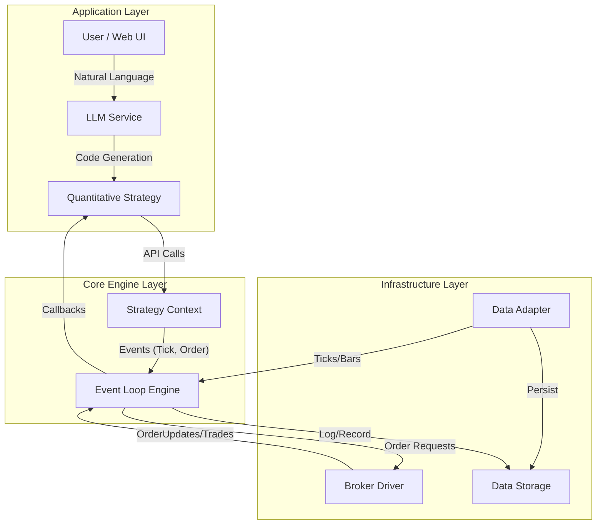
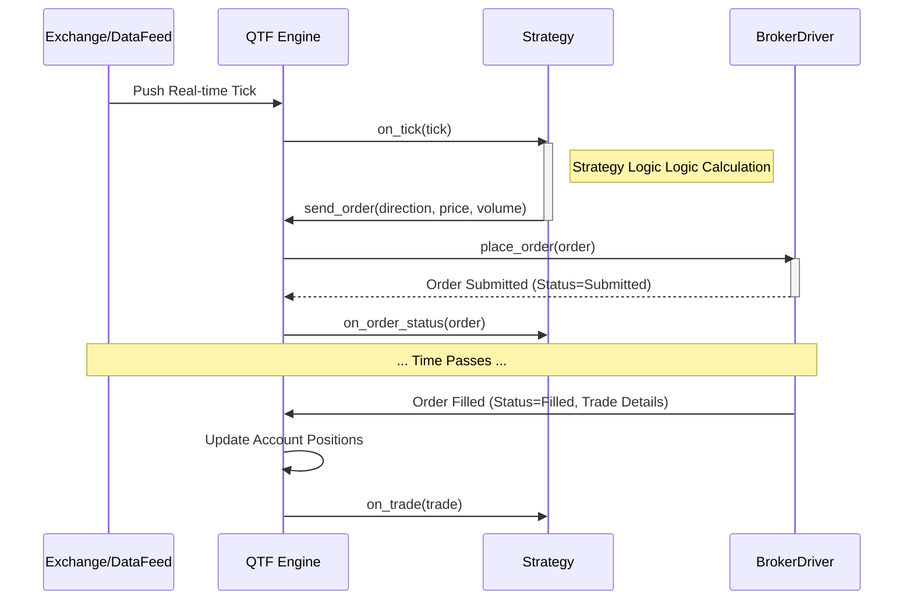

# 系统架构设计 (System Architecture)

本文档旨在详细描述 Quantitative Trading Framework (QTF) 的系统架构、模块职责以及关键流程。

## 1. 目录结构分析 (Directory Analysis)

`qtf` 核心包的目录结构及其职责如下：

### `qtf/ai` (AI Integration)
负责与大语言模型 (LLM) 的集成，实现自然语言转量化策略的功能。
*   `prompts.py`: 管理和生成用于 LLM 的 Prompt 模板。
*   `generator.py`: 调用 LLM API 生成/修改策略代码。
*   `validator.py`: (规划中) 验证生成的代码语法的正确性。

### `qtf/core` (Core Infrastructure)
系统的核心基础组件，定义了事件和异常体系。
*   `events.py`: 定义系统中的所有事件类型 (如 `EVENT_TICK`, `EVENT_ORDER`, `EVENT_TIMER`)。
*   `exceptions.py`: 定义系统自定义异常。

### `qtf/data` (Data Layer)
负责数据的接入和标准化。
*   `base.py`: 定义抽象基类 `MarketDataAdapter`。
*   `models.py`: 定义数据模型，如 `Tick`, `Bar`, `Quote`。

### `qtf/engine` (Core Engine)
系统的“大脑”，负责事件驱动、策略调度和回测逻辑。
*   `event_loop.py`: 核心事件循环，负责分发事件到注册的处理函数。
*   `context.py`: `StrategyContext`，为策略提供运行时的上下文（数据访问、账户信息的入口）。
*   `base.py`: 引擎基类。
*   `backtest.py`: 回测专用引擎，重写了时间处理逻辑，使用历史数据而非实时时间。

### `qtf/execution` (Execution Layer)
负责交易指令的执行和账户管理。
*   `base.py`: 定义抽象基类 `BrokerDriver`。
*   `models.py`: 定义交易相关模型，如 `Order`, `Trade`, `Position`。
*   (规划实现类): `RealBrokerDriver` (实盘), `PaperBrokerDriver` (模拟/回测)。

### `qtf/storage` (Persistence Layer)
负责数据的持久化存储。
*   `database.py`: 数据库连接管理 (TimeScaleDB, Redis)。
*   `repository.py`: 数据访问对象 (DAO)，封装具体的 SQL/NoSQL 操作。

---

## 2. 系统架构图 (System Architecture Diagram)

系统采用典型的分层架构，从上至下分别为：应用层(AI/Strategy)、核心层(Engine)、基础设施层(Data/Execution/Storage)。



---

## 3. 用例图 (Use Case Diagram)

描述用户与系统的主要交互场景。

```mermaid
usecaseDiagram
    actor User as "Quant Researcher / Trader"

    package "AI Assisted Development" {
        usecase "Generate Strategy from Text" as UC1
        usecase "Optimize Strategy Parameters" as UC2
    }

    package "Backtesting" {
        usecase "Run Backtest" as UC3
        usecase "View Performance Report" as UC4
    }

    package "Live Trading" {
        usecase "Start Live/Paper Trading" as UC5
        usecase "Monitor P&L Real-time" as UC6
        usecase "Manual Intervention" as UC7
    }

    User --> UC1
    User --> UC3
    User --> UC4
    User --> UC5
    User --> UC6
```

---

## 4. 核心流程图 (Flowcharts)

### 4.1 策略回测流程 (Backtest Workflow)

```mermaid
flowchart TD
    Start[Start Backtest] --> LoadConfig[Load Config & Strategy]
    LoadConfig --> InitEngine[Initialize Backtest Engine]
    InitEngine --> LoadHistory[Load Historical Data]
    
    LoadHistory --> LoopStart{Data Generator Empty?}
    
    LoopStart -- No --> NextTick[Emit Next Tick/Bar Event]
    NextTick --> StrategyOnTick[Strategy.on_tick()]
    
    StrategyOnTick -- "Signal Generated?" --> LogicCheck{Logic Check}
    LogicCheck -- Yes --> CreateOrder[Create Order Object]
    CreateOrder --> AdapterSim[Paper Broker Simulator]
    AdapterSim --> Match{Match Engine}
    
    Match -- "Matched" --> GenTrade[Generate Trade]
    GenTrade --> UpdateAcct[Update Account & Positions]
    UpdateAcct --> LoopStart
    
    Match -- "Pending" --> LoopStart
    LogicCheck -- No --> LoopStart
    
    LoopStart -- Yes --> End[End Backtest]
    End --> CalculateMetrics[Calculate Sharpe, Drawdown, etc.]
    CalculateMetrics --> Report[Generate Report]
```

---

## 5. 时序图 (Sequence Diagrams)

### 5.1 实时交易信号执行 (Live Trading Execution)

展示从行情到达 -> 策略触发 -> 报单 -> 成交回报的全过程。


